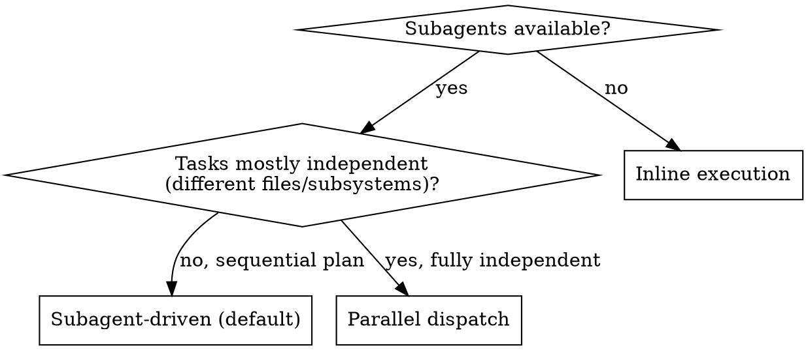

# Execute Implementation Plan

Execute a written implementation plan to completion. This skill is the single interface over three
execution **modes**; the detail for each lives behind `references/`.

**Announce at start:** "I'm using the execute-implementation-plan skill to implement this plan."

## Pick the mode

- **Subagent-driven (default)** — fresh subagent per task + two-stage review. See `references/subagent-driven.md`.
- **Parallel dispatch** — one agent per fully-independent problem, run concurrently. See `references/parallel-dispatch.md`.
- **Inline** — execute in this session when subagents aren't available (see below). On a subagent platform, prefer subagent-driven.

## Step 1: Load and Review Plan

1. Read the plan file from the task tree (`tasks/current/<task-or-epic>/plan.md`).
2. Review critically — identify any questions or concerns about the plan.
3. If concerns: raise them with your human partner before starting.
4. If none: create a TodoWrite from the tasks and proceed in the chosen mode.

## Step 2: Execute Tasks

For each task: mark in_progress → follow each bite-sized step exactly → run the specified verifications →
mark completed, and update the matching row in the epic's `kanban.md` if the plan lives in an epic.

**Inline mode specifics:** follow the plan steps directly in this session, running verifications as
specified. Do not skip verifications. Never start implementation on main/master without explicit user consent.

## Step 3: Complete Development

After all tasks complete and verified:
- **REQUIRED SUB-SKILL:** Use verify-before-completion to gate every "done" claim with fresh command output.
- Update the AgentKit task tree: mark `kanban.md` rows, move task state in `tasks/ACTIVE.md` / `tasks/STATUS.md` (repo task protocol).
- Subagent-driven mode: run the **final whole-implementation review** via the **review-code-changes** skill before finishing.
- Announce: "I'm using the finish-development-branch skill to complete this work."
- **REQUIRED SUB-SKILL:** Use finish-development-branch — it runs the repo Completion Checklist + `scripts/validate-project.py`, then presents integration options.

## When to Stop and Ask

Stop immediately when: you hit a blocker (missing dependency, failing test, unclear instruction); the plan
has critical gaps; you don't understand an instruction; or verification fails repeatedly. Ask for
clarification rather than guessing. Return to Step 1 if the partner updates the plan or the approach needs
rethinking. Don't force through blockers.

## References

- `references/subagent-driven.md` — default mode: per-task subagent + two-stage review, model selection, status handling
- `references/parallel-dispatch.md` — independent parallel problems (often reached from debug-systematically)
- `references/implementer-prompt.md`, `references/spec-reviewer-prompt.md`, `references/code-quality-reviewer-prompt.md` — subagent prompt templates

## Integration

- **prepare-isolated-workspace** — isolated workspace before execution
- **write-implementation-plan** — produces the plan this skill executes (stored in the task tree)
- **develop-with-tdd** — used inside each task
- **review-code-changes** — per-task and final reviews
- **verify-before-completion** — gate for every completion claim
- **finish-development-branch** — completion + AgentKit checklist + integration
