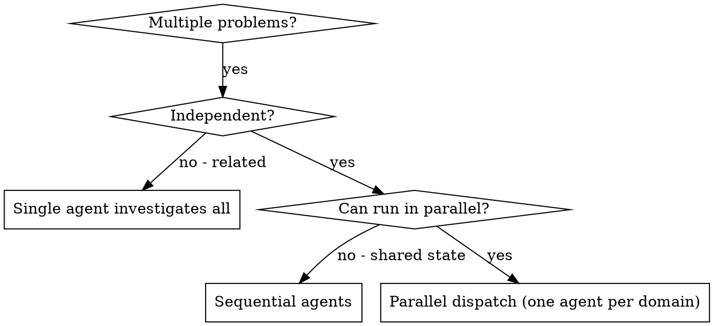

# Execution Mode: Parallel Dispatch (independent problems)

Use when you have **2+ genuinely independent** problems — different test files, different subsystems,
different bugs — with no shared state and no sequential dependency. Each gets its own agent, and they run
concurrently. Same isolation doctrine as subagent-driven mode: construct exactly the context each agent
needs; they never inherit your session history.

This is a mode of execute-implementation-plan, but it is most often reached from **debug-systematically** when several
unrelated failures surface at once.

## When to use

**Use when:** 3+ test files failing with different root causes; multiple subsystems broken independently;
each problem understandable without context from the others; no shared state.

**Don't use when:** failures are related (fixing one might fix others); you need full system state;
exploratory debugging where you don't yet know what's broken; agents would edit the same files.

## The Pattern

1. **Identify independent domains** — group failures by what's broken; confirm fixing one doesn't affect another.
2. **Create focused agent tasks** — each gets: specific scope (one file/subsystem), a clear goal, constraints
   ("don't change other code"), and a required output ("summary of root cause + what you fixed").
3. **Dispatch in parallel** — one agent per domain, run concurrently.
4. **Review and integrate** — read each summary, check for conflicts (did agents touch the same code?), run
   the full suite, spot-check (agents can make systematic errors).

## Good agent prompts

Focused (one problem domain), self-contained (all context needed inline — paste error messages and test
names), and specific about output. Constrain scope explicitly ("fix tests only, do NOT change production
code"). Avoid: "fix all the tests" (agent gets lost), "fix the race condition" (where?), vague output ("fix it").

## Common mistakes

- **Too broad** — "Fix all the tests" → scope to one file/subsystem.
- **No context** — paste the actual errors and test names.
- **No constraints** — agents may refactor everything; state what not to touch.
- **Vague output** — require a root-cause + changes summary so you can verify and check for conflicts.
