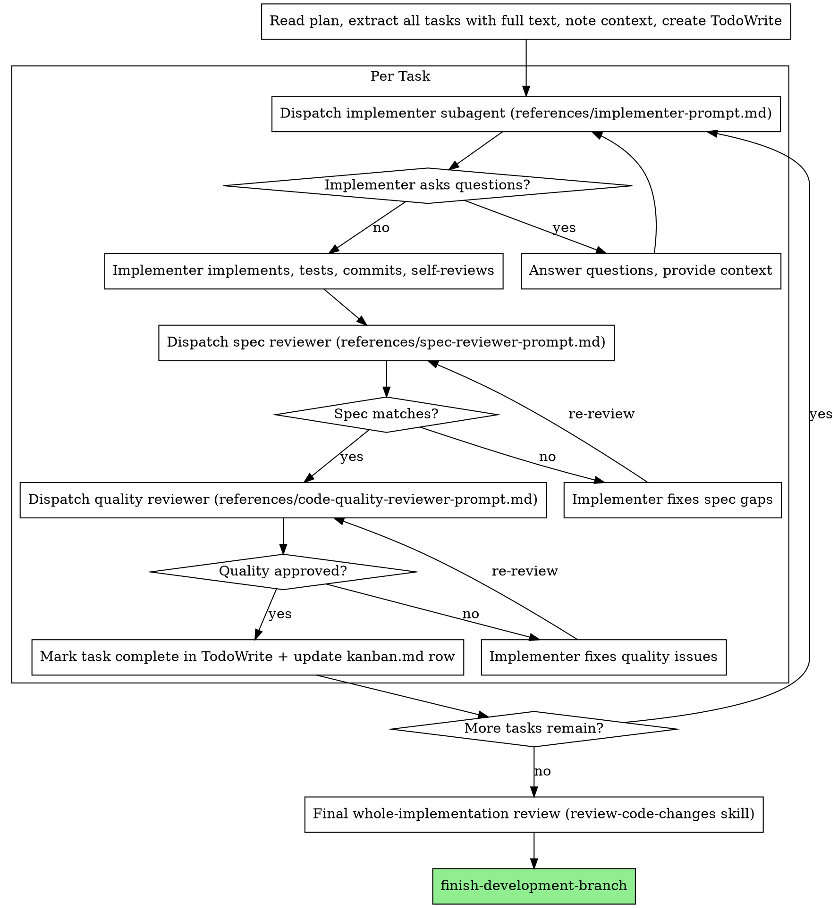

# Execution Mode: Subagent-Driven (default)

Execute the plan by dispatching a fresh subagent per task, with two-stage review after each: spec
compliance first, then code quality. This is the default mode when subagents are available (Claude Code,
Codex). It keeps your own context free for coordination and gives each task an isolated, precisely-scoped
agent that never inherits your session history.

**Core principle:** Fresh subagent per task + two-stage review (spec then quality) = high quality, fast iteration.

**Continuous execution:** Do not pause to check in between tasks. Execute all tasks without stopping. The
only reasons to stop are: a BLOCKED status you cannot resolve, ambiguity that genuinely prevents progress,
or all tasks complete. "Should I continue?" prompts waste the partner's time — they asked you to execute
the plan, so execute it.

## The Process

## Model Selection

Use the least powerful model that can handle each role to conserve cost and increase speed.

- **Mechanical tasks** (isolated functions, clear specs, 1-2 files): fast, cheap model. Most well-specified
  implementation tasks are mechanical.
- **Integration / judgment** (multi-file coordination, pattern matching, debugging): standard model.
- **Architecture / design / review**: most capable model.

Signals: 1-2 files with a complete spec → cheap; multiple files with integration concerns → standard;
design judgment or broad codebase understanding → most capable.

## Handling Implementer Status

Implementers report one of four statuses:

**DONE:** Proceed to spec compliance review.

**DONE_WITH_CONCERNS:** Completed but flagged doubts. Read them. If about correctness or scope, address
before review. If observations ("this file is getting large"), note and proceed.

**NEEDS_CONTEXT:** Provide the missing context and re-dispatch.

**BLOCKED:** Assess the blocker: (1) context problem → provide more context, re-dispatch same model;
(2) needs more reasoning → re-dispatch a more capable model; (3) task too large → break it up; (4) plan is
wrong → escalate to the human. **Never** ignore an escalation or force the same model to retry without changes.

## Prompt Templates (co-located in references/)

- `references/implementer-prompt.md` — dispatch the implementer subagent
- `references/spec-reviewer-prompt.md` — dispatch the spec compliance reviewer (stage 1)
- `references/code-quality-reviewer-prompt.md` — dispatch the code quality reviewer (stage 2)

The **final whole-implementation review** uses the canonical template from the **review-code-changes** skill
(`review-code-changes/references/code-reviewer.md`) — do not author a third per-task reviewer prompt.

## Red Flags

**Never:**
- Start implementation on main/master without explicit user consent
- Skip reviews (spec compliance OR code quality), or start quality review before spec compliance is ✅
- Proceed with unfixed issues, or move to the next task while either review has open issues
- Dispatch multiple implementation subagents in parallel for coupled tasks (conflicts)
- Make a subagent read the plan file (provide full task text instead)
- Skip scene-setting context, or ignore subagent questions
- Let implementer self-review replace actual review (both are needed)

**If a subagent asks questions:** answer clearly and completely before letting it proceed.
**If a reviewer finds issues:** same implementer fixes, reviewer re-reviews, repeat until approved.
**If a subagent fails a task:** dispatch a fix subagent with specific instructions — don't fix manually
(context pollution).

## Subagents follow TDD

Each implementer subagent uses **develop-with-tdd** for its task — failing test first,
minimal code, refactor.
