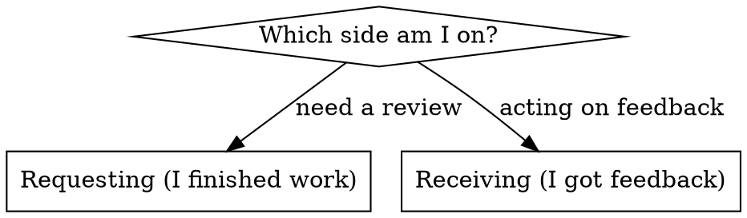

# Review Code Changes

The two halves of one loop: **requesting** a review (dispatch a reviewer, get findings) and **receiving**
one (evaluate findings, push back or fix). Pick the side you're on; the detail lives behind `references/`.

## Requesting

Dispatch a reviewer subagent with precisely crafted context (never your session history). Review early,
review often. **Mandatory** after each task in subagent-driven execution, after a major feature, and before
merge to main.

Quick path: get `BASE_SHA`/`HEAD_SHA`, fill the template at `references/code-reviewer.md`, dispatch a
`general-purpose` agent, then act on findings (Critical → fix now; Important → before proceeding; Minor →
note). Full guidance: **`references/requesting.md`**.

## Receiving

Evaluate, don't perform. Verify before implementing; ask before assuming; technical correctness over social
comfort. No "You're absolutely right!", no gratitude — restate the requirement, push back with reasoning if
wrong, or just fix it and show the code. If any item is unclear, clarify ALL items before implementing any.
Full guidance: **`references/receiving.md`**.

## References

- `references/requesting.md` — how to request a review and act on findings
- `references/receiving.md` — how to evaluate and act on feedback (response pattern, pushback, YAGNI)
- `references/code-reviewer.md` — the reviewer subagent prompt template

## Integration

- **execute-implementation-plan** — per-task reviews (subagent-driven mode) and the final whole-implementation review
- **finish-development-branch** — review before merge
- **verify-before-completion** — verify fixes actually landed before claiming done
