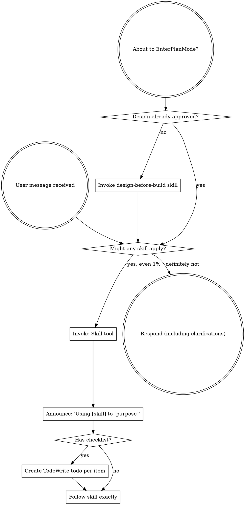

# Route Skills

<SUBAGENT-STOP>
If you were dispatched as a subagent to execute a specific task, skip this skill.
</SUBAGENT-STOP>

<EXTREMELY-IMPORTANT>
If you think there is even a 1% chance a skill might apply to what you are doing, you ABSOLUTELY MUST invoke the skill.

IF A SKILL APPLIES TO YOUR TASK, YOU DO NOT HAVE A CHOICE. YOU MUST USE IT.

This is not negotiable. This is not optional. You cannot rationalize your way out of this.
</EXTREMELY-IMPORTANT>

## Instruction Priority

Workflow skills override default system prompt behavior, but **user instructions always take precedence**:

1. **User's explicit instructions** (CLAUDE.md, GEMINI.md, AGENTS.md, direct requests) — highest priority
2. **Workflow skills** — override default system behavior where they conflict
3. **Default system prompt** — lowest priority

If CLAUDE.md, GEMINI.md, or AGENTS.md says "don't use TDD" and a skill says "always use TDD," follow the user's instructions. The user is in control.

## How to Access Skills

**In Claude Code:** Use the `Skill` tool. When you invoke a skill, its content is loaded and presented to you—follow it directly. Never use the Read tool on skill files.

**In Copilot CLI:** Use the `skill` tool. Skills are auto-discovered from installed plugins. The `skill` tool works the same as Claude Code's `Skill` tool.

**In Gemini CLI:** Skills activate via the `activate_skill` tool. Gemini loads skill metadata at session start and activates the full content on demand.

**In other environments:** Check your platform's documentation for how skills are loaded.

## Platform Adaptation

Skills use Claude Code tool names. Non-CC platforms: see `references/copilot-tools.md` (Copilot CLI), `references/codex-tools.md` (Codex) for tool equivalents. Gemini CLI users get the tool mapping loaded automatically via GEMINI.md.

## The Rule

**Invoke relevant or requested skills BEFORE any response or action.** Even a 1% chance a skill might apply means that you should invoke the skill to check. If an invoked skill turns out to be wrong for the situation, you don't need to use it.



## Red Flags

These thoughts mean STOP—you're rationalizing:

| Thought | Reality |
|---------|---------|
| "This is just a simple question" | Questions are tasks. Check for skills. |
| "I need more context first" | Skill check comes BEFORE clarifying questions. |
| "Let me explore the codebase first" | Skills tell you HOW to explore. Check first. |
| "I can check git/files quickly" | Files lack conversation context. Check for skills. |
| "Let me gather information first" | Skills tell you HOW to gather information. |
| "This doesn't need a formal skill" | If a skill exists, use it. |
| "I remember this skill" | Skills evolve. Read current version. |
| "This doesn't count as a task" | Action = task. Check for skills. |
| "The skill is overkill" | Simple things become complex. Use it. |
| "I'll just do this one thing first" | Check BEFORE doing anything. |
| "This feels productive" | Undisciplined action wastes time. Skills prevent this. |
| "I know what that means" | Knowing the concept ≠ using the skill. Invoke it. |

## Skill Priority

When multiple skills could apply, use this order:

1. **Process skills first** (design-before-build, debug-systematically) - these determine HOW to approach the task
2. **The build loop second** (write-implementation-plan → execute-implementation-plan → finish-development-branch) - these execute the work

"Let's build X" → design-before-build first, then the build loop.
"Fix this bug" → debug-systematically first, then the build loop.

## Skills In This Repo

This project has one task-rooted skill workflow. Lifecycle and workflow skills write design/spec/plan artifacts into the AgentKit task tree (`tasks/current/<task-or-epic>/`) instead of a parallel planning directory.

**Lifecycle (AgentKit-native):**
- `initialize-project-lifecycle` — initialize a brand-new repo (once, never for ongoing work)
- `stress-test-design` — stress-test a design; captures decisions into the task's `specs/`
- `improve-architecture` — find deepening/refactor opportunities (→ stress-test-design)
- `create-handoff` — package in-flight work so a fresh session can resume

**Build loop (one chain):**
```
design-before-build → stress-test-design → write-implementation-plan → execute-implementation-plan → finish-development-branch
```
with `prepare-isolated-workspace` for isolation, `develop-with-tdd` inside each task, `review-code-changes` at review points (request + receive), and `verify-before-completion` as the universal "done" gate. `execute-implementation-plan` selects its mode (subagent-per-task / parallel / inline); `finish-development-branch` runs the repo Completion Checklist + `scripts/validate-project.py`.

**Support:** `debug-systematically` (any bug; Phase 4.5 → improve-architecture; parallel-independent failures → execute-implementation-plan' parallel-dispatch mode), `author-skills` (author/edit skills).

## Skill Types

**Rigid** (TDD, debugging): Follow exactly. Don't adapt away discipline.

**Flexible** (patterns): Adapt principles to context.

The skill itself tells you which.

## User Instructions

Instructions say WHAT, not HOW. "Add X" or "Fix Y" doesn't mean skip workflows.
